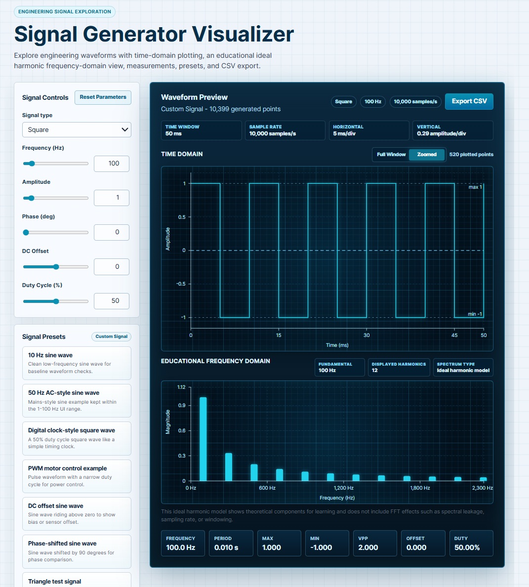

# Signal Generator Visualizer

Interactive signal generator and waveform visualizer with time-domain plotting, ideal harmonic frequency-domain visualization, measurements, presets, and CSV export.

## Live Demo

[signal-generator-visualizer.vercel.app](https://signal-generator-visualizer.vercel.app/)

## Overview

Signal Generator Visualizer is an educational engineering tool for exploring common periodic waveforms. It provides interactive controls, oscilloscope-style time-domain views, theoretical harmonic visualization, measurement readouts, presets, and CSV export in a responsive browser interface.

The frequency-domain panel uses an ideal harmonic model rather than a sampled FFT. It shows the expected theoretical harmonic components for each waveform type, making the visualization stable, predictable, and easier to understand.

## Features

- Interactive waveform generation
- Sine, square, triangle, sawtooth, and pulse waveforms
- Adjustable frequency, amplitude, phase, DC offset, and duty cycle
- Time-domain waveform plot
- Full Window and Zoomed time-domain views
- Educational frequency-domain harmonic visualization
- Measurement readouts for key signal values
- Presets for common signal examples
- CSV export for generated waveform data
- Responsive interface

## Screenshot



## How It Works

1. Select a waveform type and adjust the available signal parameters.
2. TypeScript utilities validate inputs and generate time-domain sample points.
3. The sample rate adapts to the selected frequency to keep waveforms readable.
4. Recharts renders the waveform in either Full Window or Zoomed time-domain view.
5. An ideal harmonic model calculates theoretical frequency-domain components for the selected waveform.
6. Measurement readouts summarize values such as frequency, period, minimum, maximum, peak-to-peak amplitude, offset, and duty cycle.
7. CSV export downloads the generated time-domain samples for external analysis.

## Tech Stack

- React
- TypeScript
- Vite
- Recharts
- CSS
- Vercel

## Getting Started

Clone the repository:

```bash
git clone https://github.com/hychaw/signal-generator-visualizer.git
cd signal-generator-visualizer
```

Install dependencies:

```bash
npm install
```

Start the development server:

```bash
npm run dev
```

Open the local URL printed by Vite, usually `http://localhost:5173/`.

## Build

Create a production build:

```bash
npm run build
```

Preview the production build locally:

```bash
npm run preview
```

## Future Improvements

- Real FFT analysis mode
- dB magnitude scale
- Window function selection
- Sampling and aliasing demo
- Two-signal superposition mode
- Noise and filter visualization
- Cursor measurement tools
- Audio playback for audible frequency ranges
- Export chart as image
